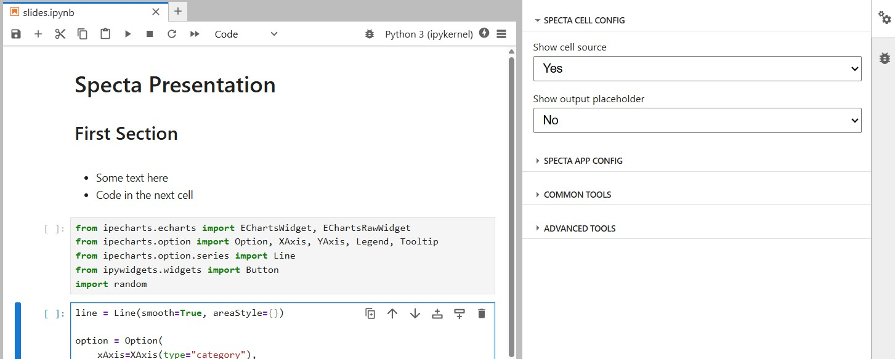

<h1 align="center">specta 🌟</h1>

[](https://github.com/trungleduc/specta/actions/workflows/build.yml)
[](https://specta.readthedocs.io/en/latest/?badge=latest)
[](https://trungleduc.github.io/specta/specta/)

<h2 align="center"> A JupyterLite app to present your Jupyter documents in different ways</h2>

Specta is a custom JupyterLite app for rendering notebooks and Jupyter‑supported files in multiple modes: dashboards, blog‑style articles, fullscreen viewers, and more. It is built on top of [JupyterLite](https://github.com/jupyterlite/jupyterlite), which allows you to share your documents through alternative interfaces to the IDE-like JupyterLab.

## Features

### Multi-mode Notebook Rendering

Render notebooks in:

- **Dashboard mode** – structured panels for interactive widgets and outputs.
- **Article mode** – a minimal, blog-like reading experience.
- **Slides mode** – a fullscreen presentation mode.

### Clean Viewer for all Jupyter-supported file types

View any Jupyter-supported file using Specta's clean viewer with all Jupyter UI elements removed.

### Preview from JupyterLab

A `specta` preview can be launched directly from JupyterLab, letting users verify how their documents will look when published.

## Try it online!

You can try it online by clicking on this badge:

[](https://trungleduc.github.io/specta/specta/)

## Installation and Usage

You can install `specta` using `pip` or `conda`

```bash
# Install using pip
pip install specta

# Install using conda
conda install -c conda-forge specta
```

Once installed, you can build your JupyterLite app, a `specta` app will be included automatically in the output directory of `jupyterlite`:

```
jupyter lite build
```

Then serve the contents of the output directory (by default `./_output`) using any static file server. You can access the `Specta` app at the `/specta/` path.

If you want to disable specta loading spinner, you can set the environment variable `SPECTA_NO_LOADING_SCREEN` to `1`before calling jupyterlite build command

## Specta Configuration

### Available layouts

Specta comes with three built-in layouts:

- `default`: The default layout, which renders the notebook as a dashboard.
- `article`: A minimal, blog-like reading experience.
- `slides`: A fullscreen presentation mode using [reveal.js](https://revealjs.com/).

### Top-level configuration

Specta can be configured using the typicall JupyterLite configuration file: `jupyter-lite.json`. You can add a `spectaConfig` key to the `jupyter-config-data` section of this file to customize the Specta app.

The following options are available:

- `defaultLayout`: The default layout when opening a file.
- `executionDelay`: Delay (in miliseconds) before executing cells.
- `hideTopbar`: Boolean flag to show or hide the top bar.
- `topBar`: Configuration for the top bar.
- `slidesTheme`: The theme for the slides layout. The list of available themes can be found [here](https://revealjs.com/themes/).
- `loadingName`: The string shown during the loading of specta (default to Loading Specta) only available globally not per file.

```json
      "topBar": {
        "icon": "url to the icon file, it's shown on the left of the top bar",
        "title": "Title on the left of the top bar",
        "themeToggle": "Boolean flag to show/hide the theme selector",
        "textColor": "Color of the text on the top bar",
        "background": "Background color of the top bar"
      },
```

- `perFileConfig`: an object with key is the file path and value is the above configuration, it's used to have different layout/top bar config for each files, for example:

```json
      "perFileConfig": {
        "blog.ipynb": {
          "hideTopbar": false,
          "defaultLayout": "article",
          "topBar": {
            "title": "My blog",
            "themeToggle": false
          }
        },
        "slides.ipynb": {
          "hideTopbar": true,
          "slidesTheme": "sky"
        }
      }
```

### Notebook metadata configuration

In addition to the global configuration, you can also configure the layout and top bar for each notebook by using the notebook metadata. You can use the `Specta App Config` of the `Property Inspector` panel of JupyterLab to edit the notebook metadata.


### Notebook cell configuration

By default, when you open a notebook in Specta, all code cells are hidden, and placeholder skeletons are shown instead at the position of the cell. You can configure the visibility of each cell by using the Specta cell metadata toolbar.



By opening the `Property Inspector` panel of JupyterLab and selecting the `Specta Cell Config` section, you can change the display of each cell as follows:

- `Show cell source`: use this toggle to show or hide the cell source code. Default to `false`
- `Show output placeholder`: use this toggle to show or hide the output skeleton. Default to `true`
- `Output size`: use this dropdown to select the size of the cell output. Default to `Small`

### Slides layout configuration

For the slides layout, you can set the cells as a sub-slide for [vertical slide](https://revealjs.com/vertical-slides/) or [a fragment](https://revealjs.com/fragments/) using the Slide Type field in the `Common Tools` section of the `Property Inspector` panel.


